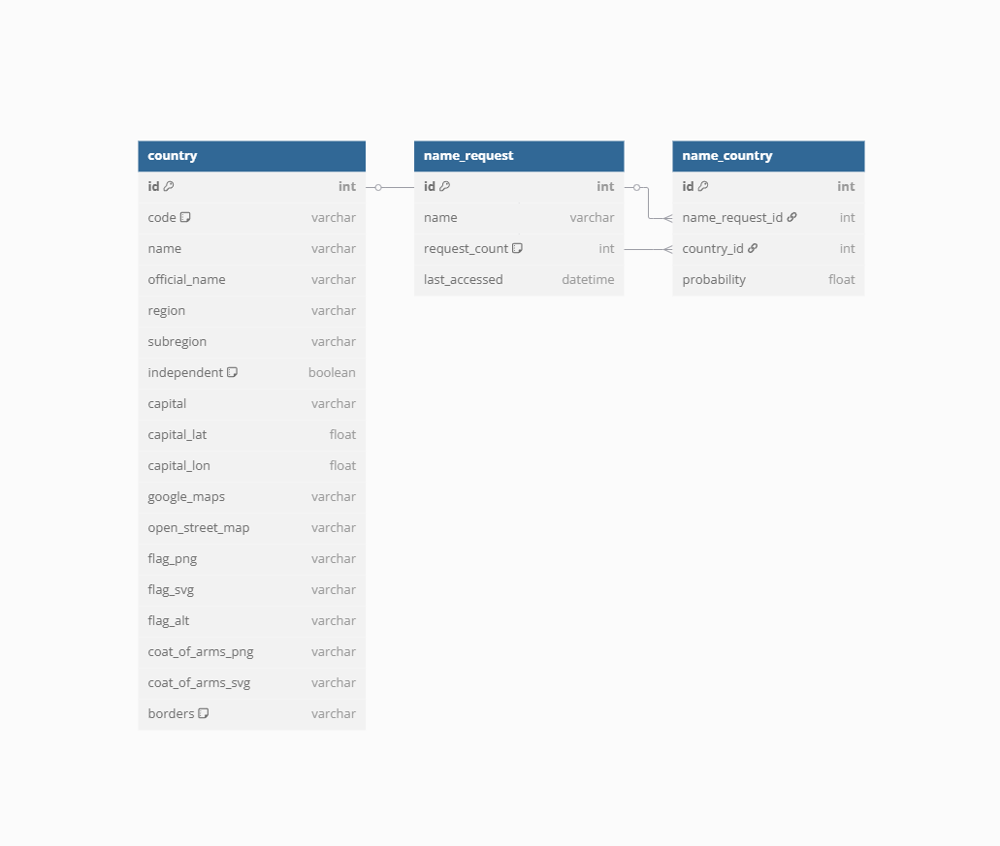

# Name Nation


## Description
API that predicts name origin and enriches country data. Provides fast and reliable name-based nationality predictions with enriched country details.


## Technologies Used
- Python
- Django ORM
- Django
- DRF
- Docker
   

## API Features
- Name probability lookup by the given name
- Country details enrichment from external API
- Popular names retrieval by country


## Setup
To install the project locally on your computer, execute the following commands in a terminal:
```bash
git clone https://github.com/Illya-Maznitskiy/name-nation.git
cd name-nation
python -m venv venv
venv\Scripts\activate (on Windows)
source venv/bin/activate (on macOS)
pip install -r requirements.txt
```


## Commands to test the project:
You can run the tests and check code style using `ruff` with the following commands:

```bash
pytest
ruff check .
```


## Configuration .env
1. Create an .env file in the project root using the sample.env as a template.
2. Replace your_dummy_secret_key_here with a real secret key (generate one at Djecrety). [Djecrety](https://djecrety.ir/)


## Running Locally
1. Apply migrations:
```bash
python manage.py migrate
```
2. Run the development server:
```bash
python manage.py runserver
```

## Docker Configuration
### _Dockerfile_
Configures the Django app environment.

### _docker-compose.yml_
This file sets up the Docker services.


## Docker Setup
To set up and run the project using [Docker](https://www.docker.com/get-started/), follow these steps:

1. **Ensure Docker is Running**:
    ```text
    Make sure Docker Desktop is installed and running on your system.
    ```

2. **Build the Docker Images**:
    ```bash
    docker-compose build
    ```

3. **Start the Services**:
    ```bash
    docker-compose up
    ```

4. **Stop the Services**:
    ```bash
    docker-compose down
    ```


## API Endpoints
- GET /names/?name=... — Get country probabilities for a given name
- GET /popular-names/?country=... — Get top 5 popular names for a country


## Screenshots:

# Database Schema

